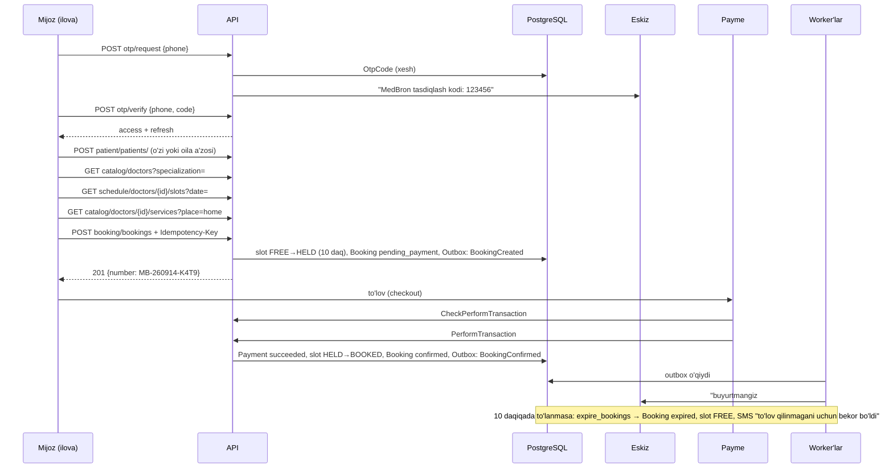
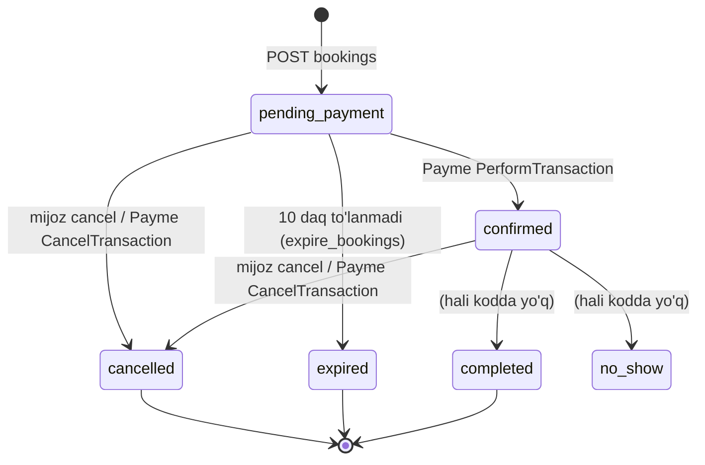
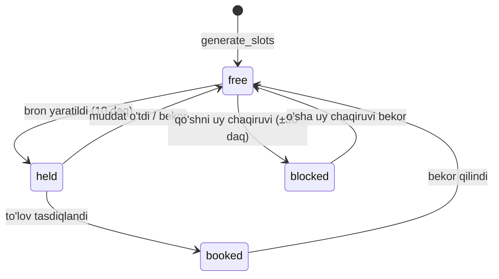

# MedBron — API va biznes logika hujjati

> Har bir endpoint: **nima qiladi**, **qanday ishlaydi** (qadamma-qadam), **qanday qoidalarga bo'ysunadi**, va tizimda qanday **iz qoldiradi** (hodisa, metrika, analitika).
>
> Kod holati: 2026-09-14. Interaktiv hujjat: `python manage.py runserver` → http://127.0.0.1:8000/api/docs/
>
> Arxitektura va fayllar bo'yicha batafsil: `LOYIHA_HUJJATI.md`.

---

## Mundarija

1. [Umumiy ma'lumot](#1-umumiy-malumot)
2. [Mijoz yo'li (end-to-end oqim)](#2-mijoz-yoli-end-to-end-oqim)
3. [Auth — OTP va JWT](#3-auth--otp-va-jwt)
4. [Bemor va manzil](#4-bemor-va-manzil)
5. [Katalog](#5-katalog)
6. [Jadval (bo'sh vaqtlar)](#6-jadval-bosh-vaqtlar)
7. [Bron](#7-bron)
8. [To'lov (Payme webhook)](#8-tolov-payme-webhook)
9. [Infratuzilma endpointlari](#9-infratuzilma-endpointlari)
10. [Holat mashinalari](#10-holat-mashinalari)
11. [Fon jarayonlari (API'siz biznes logika)](#11-fon-jarayonlari-apisiz-biznes-logika)
12. [Hodisalar (Kafka)](#12-hodisalar-kafka)
13. [Analitika va metrikalar](#13-analitika-va-metrikalar)
14. [Biznes qoidalar jamlanmasi](#14-biznes-qoidalar-jamlanmasi)
15. [⚠️ Topilgan bo'shliqlar va xavflar](#15-️-topilgan-boshliqlar-va-xavflar)

---

## 1. Umumiy ma'lumot

### Platforma nima qiladi
Tibbiy xizmatlarni bron qilish: mijoz **shifokorni topadi → bo'sh vaqtni tanlaydi → xizmat(lar)ni tanlaydi → bron qiladi → to'laydi → SMS oladi**. Xizmat **klinikada** yoki **uy chaqiruvi** shaklida bo'ladi.

### Rollar
| Rol (`User.role`) | Kim | API'dagi o'rni |
|---|---|---|
| `client` | Mijoz | Barcha mijoz endpointlari. OTP orqali kirganda default shu rol |
| `doctor` | Shifokor | Hozircha alohida endpoint yo'q (admin/shell orqali boshqariladi) |
| `clinic_admin` | Klinika admini | Hozircha endpoint yo'q |
| `platform_admin` | Platforma admini | Django admin (`/admin/`) |

### Endpointlar jadvali

| # | Metod | URL | Auth | Vazifa |
|---|---|---|---|---|
| 1 | POST | `/api/v1/accounts/auth/otp/request` | ochiq | SMS kod yuborish |
| 2 | POST | `/api/v1/accounts/auth/otp/verify` | ochiq | Kodni tekshirish, token olish (ro'yxatdan o'tish ham shu) |
| 3 | GET/POST | `/api/v1/patient/patients/` | JWT | Bemorlar ro'yxati / qo'shish |
| 4 | GET/PUT/PATCH/DELETE | `/api/v1/patient/patients/{id}/` | JWT | Bitta bemor |
| 5 | GET/POST | `/api/v1/patient/addresses/` | JWT | Manzillar ro'yxati / qo'shish |
| 6 | GET/PUT/PATCH/DELETE | `/api/v1/patient/addresses/{id}/` | JWT | Bitta manzil |
| 7 | GET | `/api/v1/catalog/specializations` | ochiq | Mutaxassisliklar |
| 8 | GET | `/api/v1/catalog/clinics` | ochiq | Faol klinikalar |
| 9 | GET | `/api/v1/catalog/doctors` | ochiq | Shifokorlar ro'yxati (filtr) |
| 10 | GET | `/api/v1/catalog/doctors/{id}` | ochiq | Shifokor kartochkasi |
| 11 | GET | `/api/v1/catalog/doctors/{id}/services` | ochiq | Shifokor xizmatlari |
| 12 | GET | `/api/v1/schedule/doctors/{id}/slots` | ochiq | Bo'sh vaqtlar |
| 13 | POST | `/api/v1/booking/bookings` | JWT | Bron yaratish |
| 14 | GET | `/api/v1/booking/bookings/mine` | JWT | Mening bronlarim |
| 15 | GET | `/api/v1/booking/bookings/{id}` | JWT | Bron tafsiloti |
| 16 | POST | `/api/v1/booking/bookings/{id}/cancel` | JWT | Bronni bekor qilish |
| 17 | POST | `/api/v1/payment/payme/webhook` | Payme Basic Auth | Payme to'lov protokoli |
| 18 | GET | `/healthz/live` | ochiq | Kubernetes liveness |
| 19 | GET | `/healthz/ready` | ochiq | Kubernetes readiness |
| — | GET | `/api/docs/`, `/api/redoc/`, `/api/schema/` | ochiq (faqat `SWAGGER_ENABLED`) | Swagger / OpenAPI |
| — | — | `/admin/` | Django sessiya | Admin panel |

### Umumiy konventsiyalar

| Mavzu | Qoida |
|---|---|
| **ID'lar** | Hamma joyda UUID (servislarga ajratilganda to'qnashmasligi uchun) |
| **Vaqt** | Bazada va API javobida **UTC** (ISO 8601). Jadval qoidalari va "bugun" tushunchasi **Asia/Tashkent** da |
| **Pul** | `Decimal`, 2 xona, so'mda. Payme bilan almashuvda **tiyin** (×100) |
| **Autentifikatsiya** | `Authorization: Bearer <access>`. Default — yopiq (`IsAuthenticated`); ochiq endpointlar ataylab `permission_classes = []` |
| **Xato formati** | `{"detail": "..."}` (DRF). Validatsiya xatosida maydon bo'yicha: `{"phone": ["..."]}` |
| **Throttle** | OTP endpointlari: IP bo'yicha `10/hour` (`THROTTLE_OTP`) → 429 |

### HTTP status kodlari — ma'nosi
| Kod | Qachon | Klient nima qilishi kerak |
|---|---|---|
| 200 | Muvaffaqiyat (yoki idempotent takror) | — |
| 201 | Yangi obyekt yaratildi | — |
| 400 | **So'rov noto'g'ri** (format yoki biznes qoidasi: `InvalidBookingRequest`) | So'rovni tuzatish. Qayta yuborish foydasiz |
| 401 | Token yo'q/buzuq/eskirgan | Refresh yoki qayta kirish |
| 403 | Akkaunt bloklangan | — |
| 404 | Topilmadi **yoki boshqa foydalanuvchiniki** | — (egalik oshkor qilinmaydi) |
| 409 | **So'rov to'g'ri, lekin hozir bajarib bo'lmaydi** (`BookingError`: slot band, holat mos emas) | Boshqa vaqt tanlash |
| 429 | Juda ko'p urinish | Kutish |
| 503 | SMS provayder ishlamayapti / baza yo'q | Birozdan keyin |

> **400 va 409 farqi muhim** (`api/booking/utils.py:custom_exception_handler`): 400 = "siz xato qildingiz", 409 = "siz to'g'ri, lekin kimdir sizdan oldin ulgurdi". Mobil ilova ularga har xil ekran ko'rsatadi.

---

## 2. Mijoz yo'li (end-to-end oqim)



---

## 3. Auth — OTP va JWT

**Kod:** `api/account/` · **Model:** `User`, `OtpCode`

Parolsiz tizim: **telefon raqami = login**, SMS kod = parol. Ro'yxatdan o'tish va kirish **bitta oqim** (raqam yangi bo'lsa foydalanuvchi avtomatik yaratiladi) — mobil ilovada bitta ekran kam.

### 3.1 `POST /api/v1/accounts/auth/otp/request` — kod so'rash

| | |
|---|---|
| Auth | ochiq |
| Body | `{"phone": "+998 90 123 45 67"}` (max 20 belgi) |
| 200 | `{"detail": "Kod yuborildi"}` |
| 429 | `{"detail": "45 soniyadan keyin qayta urinib ko'ring"}` / `"Juda ko'p urinish..."` |
| 503 | `{"detail": "SMS yuborib bo'lmadi. Birozdan keyin urinib ko'ring"}` |

**Qanday ishlaydi** (`services.request_otp`):
1. Raqam normalizatsiya: `+998 90 123 45 67` → `+998901234567` (bo'shliq/tire olib tashlanadi, `+` qo'shiladi). Usiz bitta odam bazada bir necha marta paydo bo'lardi
2. **Uch qatlamli limit** — bu endpoint **pul sarflaydi** (har SMS pullik):
   | Qatlam | Qiymat | Himoya |
   |---|---|---|
   | Qayta yuborish kutishi | 60 soniya (bitta raqamga) | Tugmani ketma-ket bosish |
   | Raqam bo'yicha | 5 kod / soat | Begona odamga SMS yog'dirish |
   | IP bo'yicha | 20 kod / soat | Bitta hujumchi ko'p raqam bilan |
   | DRF throttle | 10 so'rov / soat (IP) | Arzon, keshda, birinchi to'siq |
3. Shu raqamning eski ishlatilmagan kodlari bekor qilinadi — **bir vaqtda faqat bitta kod amal qiladi**
4. Kod: `secrets.randbelow(1_000_000)` → 6 xonali. `random` emas — u bashorat qilinadi
5. Bazaga **faqat xesh** yoziladi (`make_password`), TTL 5 daqiqa, IP saqlanadi
6. SMS: `templates.otp` shabloni → `SMS_PROVIDER` (lokal: terminalga log; prod: Eskiz)
7. **SMS ketmasa** → `OtpCode` o'chiriladi (limit va kutish sarflanmaydi) va **503**. OTP uchun *fail-closed*: "Kod yuborildi" deb yolg'on aytilmaydi

**Xavfsizlik:** javob raqam tizimda bor-yo'qligidan qat'i nazar **bir xil** (user enumeration himoyasi). Logda raqam maskalangan: `+998901******`.

### 3.2 `POST /api/v1/accounts/auth/otp/verify` — kodni tekshirish

| | |
|---|---|
| Auth | ochiq |
| Body | `{"phone": "+998901234567", "code": "123456"}` (aynan 6 belgi) |
| 200 | pastda |
| 400 | `"Kod noto'g'ri"` / `"Kod noto'g'ri yoki muddati o'tgan"` / `"Urinishlar soni tugadi. Yangi kod so'rang"` |
| 403 | `"Akkaunt bloklangan"` |

```json
{
  "tokens": {"access": "eyJ...", "refresh": "eyJ..."},
  "is_new_user": true,
  "user": {"id": "uuid", "phone": "+998901234567", "full_name": "", "role": "client"}
}
```

**Qanday ishlaydi** (`services.verify_otp`):
1. Eng yangi ishlatilmagan kod olinadi. Yo'q yoki eskirgan → 400
2. **Urinish AVVAL sanaladi** (`attempts + 1`, atomik `F()`), keyin tekshiriladi — xato yuz bersa ham hisoblagich oshadi
3. `attempts > 5` → kod kuydiriladi (`is_used=True`) → 400. 6 xonali kod (10⁶ variant) + 5 urinish = brute-force ehtimoli 0.0005%
4. Xeshni solishtirish (`check_password`)
5. Tranzaksiyada: kod `is_used`, foydalanuvchi topiladi **yoki yaratiladi** (`role=client`, `is_phone_verified=True`, parolsiz)
6. `is_active=False` → 403
7. JWT juftligi (`issue_tokens`)

**Tokenlar** (`SIMPLE_JWT`):
| Token | Muddat | Nega |
|---|---|---|
| `access` | 15 daqiqa | Har so'rovda ketadi → o'g'irlansa tez eskiradi |
| `refresh` | 30 kun | Kamdan-kam ketadi. **Rotation** yoqilgan: ishlatilgan refresh qora ro'yxatga tushadi |

`refresh` ichida `role` claim bor — kelajakdagi API gateway shu bo'yicha marshrutlaydi.

> ⚠️ **Refresh endpointi ulanmagan** (`TokenRefreshView` yo'q) — 15 daqiqadan keyin mijoz qayta OTP so'rashi kerak. 15-bo'lim.

---

## 4. Bemor va manzil

**Kod:** `api/patients/` · **Model:** `Patient`, `Address` · Oddiy DRF `ModelViewSet` (to'liq CRUD).

### Biznes ma'nosi
- **Bron `User` ga emas, `Patient` ga bog'lanadi.** Bitta akkauntdan o'zi, onasi, bolasi uchun bron qilish mumkin ("Siz / Onam / Otam" ekrani)
- **Manzil** — faqat uy chaqiruvi uchun kerak

### 4.1 Bemorlar — `/api/v1/patient/patients/`

| Metod | URL | Natija |
|---|---|---|
| GET | `/patients/` | Faqat **o'zimning** bemorlarim, yangilari birinchi |
| POST | `/patients/` | 201 |
| GET | `/patients/{id}/` | 200 / 404 |
| PUT/PATCH | `/patients/{id}/` | 200 |
| DELETE | `/patients/{id}/` | 204 (bronlari bo'lsa — pastda ⚠️) |

**Maydonlar:**
| Maydon | Tur | Izoh |
|---|---|---|
| `id` | UUID | faqat o'qish |
| `full_name` | string | |
| `relation` | string | "O'zim", "Onam", "O'g'lim" |
| `birth_date` | date | analitikada yosh guruhi (`0-17`, `18-40`, `41-65`, `65+`) shundan |
| `gender` | `male`/`female` | |
| `weight_kg` | decimal, ixtiyoriy | dori dozasi uchun |

**Qoidalar:**
- `owner` maydoni serializerda **yo'q** — server `request.user` dan qo'yadi. Klient o'zini boshqa odamning bemoriga "ega" qilib yoza olmaydi
- `get_queryset` → `filter(owner=request.user)`: boshqa odamning bemori ID bilan so'ralsa **404** (IDOR himoyasi)

### 4.2 Manzillar — `/api/v1/patient/addresses/`

Xuddi shu CRUD. **Maydonlar:** `label` ("Uy", "Ish"), `city`, `street`, `entrance` (podyezd), `floor`, `apartment`, `comment` ("Podyezd oldida it bor"), `latitude`, `longitude`, `is_default`.

**Qoidalar:**
- Faqat o'zimning manzillarim (`filter(user=request.user)`), saralash: standart manzil birinchi
- **Bitta foydalanuvchida faqat bitta standart manzil:** `is_default=true` bilan yaratilsa/yangilansa, qolganlari bitta `UPDATE` bilan `false` bo'ladi (`utils._clear_other_defaults`)

---

## 5. Katalog

**Kod:** `api/catalog/` · **Model:** `Specialization`, `Clinic`, `Doctor`, `DoctorAffiliation`, `Service` · Hammasi **ochiq** (ro'yxatdan o'tmagan mijoz ham ko'radi).

**Arxitektura qoidasi:** view'lar model emas, `services.py` dagi **DTO** qaytaradigan funksiyalarni chaqiradi — keyin katalog alohida servisga chiqqanda logika o'zgarmaydi.

### 5.1 `GET /api/v1/catalog/specializations`
Barcha mutaxassisliklar, nom bo'yicha. Maydonlar: `id`, `name`, `slug`, `is_pediatric` ("Bolalar" filtri). Paginatsiya yo'q (ro'yxat kichik va kamdan-kam o'zgaradi).

### 5.2 `GET /api/v1/catalog/clinics?city=&limit=&offset=`
| Qoida | |
|---|---|
| Faqat | `status=active` (moderatsiyadan o'tgan, to'xtatilmagan) |
| Filtr | `city` — aniq moslik |
| Saralash | reyting ↓, sharhlar soni ↓ |
| Paginatsiya | `limit` default 20, **max 50**; `offset` default 0. Xato/manfiy qiymat → default |

Maydonlar: `id`, `name`, `city`, `street`, `latitude`, `longitude`, `rating`, `reviews_count`.

### 5.3 `GET /api/v1/catalog/doctors` — shifokorlar ro'yxati

| Parametr | Tur | Ma'nosi |
|---|---|---|
| `specialization` | UUID | shu mutaxassislik |
| `clinic` | UUID | shu klinikada **faol** ishlaydiganlar |
| `home_only` | `1`/`true`/`yes` | faqat uy chaqiruvi qabul qiladiganlar |
| `limit` / `offset` | int | 20 (max 50) / 0 |

**Kim ko'rinadi** — "bron qilsa bo'ladigan" shifokor qoidasi (`is_doctor_bookable`), **bitta joyda**:
> `Doctor.status = approved` **VA** `user.is_active = true`

Saralash: reyting ↓, sharhlar ↓. N+1 yo'q (`select_related` + `prefetch_related` — usiz 20 shifokor = 41 so'rov).

**Javob** (yengil — ro'yxatda 20+ element):
```json
[{"id": "uuid", "full_name": "Dr. Aliyev", "experience_years": 10, "rating": "4.80",
  "reviews_count": 120, "specializations": ["Terapevt"], "accepts_home_visits": true}]
```

### 5.4 `GET /api/v1/catalog/doctors/{id}` — shifokor kartochkasi
Ro'yxatdagi maydonlar **+** og'irlari: `bio`, `license_number`, `home_visit_radius_km`, `clinics[]` (faqat **faol affiliatsiya** va **faol klinika**). Topilmasa 404.

> Kartochkada `is_bookable` yo'q (DTO'da bor, serializer'da chiqarilmagan).
>
> ⚠️ Kartochka `approved` bo'lmagan shifokorni ham qaytaradi (ro'yxatda esa ko'rinmaydi). 15-bo'lim.

### 5.5 `GET /api/v1/catalog/doctors/{id}/services?place=clinic|home`
Shifokorning **faol** xizmatlari, narx bo'yicha ↑. Maydonlar: `id`, `name`, `place`, `price`, `duration_minutes`.

- `place` noto'g'ri → 400
- **Nega `place` filtri muhim:** bitta bronda klinika va uy xizmatini aralashtirib bo'lmaydi (7.1). Ilova avval rejimni tanlaydi, keyin shu rejim xizmatlarini so'raydi

---

## 6. Jadval (bo'sh vaqtlar)

**Kod:** `api/schedule/` · **Model:** `WorkingRule`, `ScheduleException`, `TimeSlot` · Loyihaning **yuragi**.

### Slotlar qayerdan keladi
Slotlarni hech kim qo'lda yaratmaydi:
1. Shifokor **qoida** yozadi: `WorkingRule` — "dushanba 09:00–17:00, 30 daqiqalik, klinikada" (`clinic=null` → uy chaqiruvi)
2. **Istisnolar**: `ScheduleException` — ta'til/bayram kunlari
3. Har kecha `generate_slots` (11-bo'lim) qoidalardan **30 kun oldinga** aniq `TimeSlot` qatorlarini yaratadi. Idempotent — qayta ishlasa dublikat yo'q

**Asosiy invariant** (bazada, kodda emas):
> `UNIQUE(doctor, start_at)` — bitta shifokor bitta vaqtda **faqat bitta joyda**. Constraint'da `clinic` ataylab yo'q: shifokor bir vaqtda ham klinikada, ham uyda bo'lolmaydi.

### 6.1 `GET /api/v1/schedule/doctors/{id}/slots`
**Eng ko'p chaqiriladigan endpoint** — ro'yxatdagi har bir shifokor kartochkasi ostida bo'sh vaqtlar bor.

**Ikki rejim:**

| So'rov | Rejim | Kesh | Cheklov |
|---|---|---|---|
| `?date=2026-09-15` yoki **parametrsiz** (= bugun, Toshkent) | bitta kun | ✅ 30 s (server) + `Cache-Control: public, max-age=30` | — |
| `?date_from=...&date_to=...` (ISO datetime) | oraliq (kalendar) | ❌ | max **30 kun** (aks holda 400), max **200 slot** |

**Qaysi slotlar qaytadi:** `status=free` **va** `start_at >= max(hozir + 60 daqiqa, date_from)` — **eng yaqin bron 1 soatdan keyin** (shifokor tayyorlanishi uchun).

Javob: `[{"id": "uuid", "start_at": "2026-09-15T04:00:00Z", "end_at": "2026-09-15T04:30:00Z"}]` — ataylab faqat 3 maydon (200 slotga ko'paytiriladi).

**Kesh qanday yangilanadi:** TTL 30 s — xavfsizlik to'ri. Asosiysi — **hodisaga asoslangan tozalash**: bron yaratilganda, tasdiqlanganda, bekor qilinganda shu shifokorning shu kunining keshi tranzaksiya commit'idan keyin o'chiriladi. Ya'ni band qilingan slot "bo'sh" bo'lib ko'rinib turmaydi.

> "Bugun" va kesh kuni **Toshkent vaqtida** hisoblanadi: UTC'da soat 02:00 da `.date()` kechagi kunni berardi.

---

## 7. Bron

**Kod:** `api/booking/` · **Model:** `Booking`, `BookingItem` · Hammasi JWT talab qiladi.

### 7.1 `POST /api/v1/booking/bookings` — bron yaratish

| | |
|---|---|
| Header | `Authorization: Bearer ...`, ixtiyoriy `Idempotency-Key: <uuid>` |
| 201 | yangi bron |
| 200 | shu `Idempotency-Key` bilan bron allaqachon bor — **o'sha qaytadi** |
| 400 | biznes qoidasi buzildi |
| 409 | slot band |

**Body** (serializer faqat **format**ni tekshiradi):
```json
{
  "patient_id": "uuid",
  "doctor_id": "uuid",
  "slot_id": "uuid",
  "service_ids": ["uuid"],        // 1..10 ta
  "address_id": "uuid | null",     // uy chaqiruvida majburiy
  "comment": "..."                 // ixtiyoriy, max 1000
}
```

**Javob:**
```json
{
  "id": "uuid", "number": "MB-260914-K4T9", "status": "pending_payment",
  "status_display": "To'lov kutilmoqda", "total_price": "150000.00",
  "created_at": "2026-09-14T10:00:00Z",
  "items": [{"service_name": "Konsultatsiya", "price": "150000.00", "duration_minutes": 30}]
}
```

**Qanday ishlaydi — qadamma-qadam:**

**0. Idempotency.** `Idempotency-Key` berilgan va shu foydalanuvchida shu kalitli bron bor → yangi bron yaratilmaydi, mavjudi **200** bilan qaytadi. Sabab: mobil tarmoq javobni yo'qotsa ilova so'rovni takrorlaydi — kalitsiz ikki bron va ikki to'lov bo'lardi.

**1. Biznes tekshiruvlari** (`_validate_and_load_services`, hammasi bitta joyda → 400):
| # | Qoida | Xato |
|---|---|---|
| 1 | Kamida bitta xizmat | "Kamida bitta xizmat tanlanishi kerak" |
| 2 | Shifokor bron qabul qiladi (`approved` + faol) | "Shifokor hozircha bron qabul qilmaydi" |
| 3 | Barcha xizmatlar mavjud va **faol** | "Ba'zi xizmatlar topilmadi yoki faol emas" |
| 4 | **Klinika va uy xizmatlari aralashmaydi** | "Bitta bronda klinika va uy xizmatlarini aralashtirib bo'lmaydi" |
| 5 | Uy chaqiruvi → `address_id` majburiy | "Uy chaqiruvi uchun manzil ko'rsatilishi shart" |

**2. Bitta tranzaksiyada:**
1. **Slotni band qilish** (`hold_slot`) — *compare-and-set*:
   ```sql
   UPDATE timeslot SET status='held', hold_expires_at=now()+10min WHERE id=? AND status='free'
   ```
   0 qator o'zgarsa → **409 "Bu vaqt allaqachon band qilingan"**. Baza bu `UPDATE` ni atomik bajaradi — 100 ta parallel so'rovdan **aynan bittasi** o'tadi (testda isbotlangan)
2. **Uy chaqiruvi bo'lsa — yo'l vaqti buferi:** shu shifokorning **±30 daqiqa** ichidagi bo'sh slotlari `blocked` bo'ladi (12:00 da bemor uyida bo'lgan shifokor 12:30 da boshqa manzilda bo'lolmaydi). Qatorlar `start_at` tartibida qulflanadi — deadlock bo'lmasligi uchun. Klinikadagi qabulda bufer yo'q
3. **Summa** = tanlangan xizmatlar narxlari yig'indisi
4. **Bron raqami:** `MB-YYMMDD-XXXX`, alifboda chalkashadigan belgilar yo'q (`0/O`, `1/I`) — telefonda aytish oson. Bandligi tekshiriladi, 5 urinish
5. `Booking` → `pending_payment`
6. `BookingItem` — xizmat nomi, narxi, davomiyligi **SNAPSHOT**: ertaga narx o'zgarsa, bu bron va hisobotlar o'zgarmaydi
7. **Hodisa** `BookingCreated` → outbox (xuddi shu tranzaksiyada)
8. Slot keshi tozalanadi (commit'dan keyin)

Tranzaksiyaning biror joyi yiqilsa — **hammasi orqaga**, slot ham `free` ga qaytadi.

**3. Keyin:** 10 daqiqa ichida to'lov kelmasa → `expire_bookings` (11-bo'lim) bronni `expired`, slotni `free` qiladi.

**Metrikalar:** `medbron_bookings_created_total{doctor_specialization, place}`, `medbron_bookings_failed_total{reason=validation|slot_taken}`, `medbron_booking_duration_seconds`.

> ⚠️ **Muhim bo'shliqlar bor** — bemor/manzil egaligi, slot↔shifokor, xizmat↔shifokor tekshirilmaydi, va to'lov yozuvi yaratilmaydi. 15-bo'lim, 1–4-bandlar.

### 7.2 `GET /api/v1/booking/bookings/mine` — mening bronlarim
Faqat `client = request.user`, yangilari birinchi, item'lar bilan (N+1 yo'q). **Cursor paginatsiya** (C15.1): `?page_size=` (20, max 50), `?cursor=`; filtrlar `?status=confirmed,completed`, `?date_from=&date_to=` (qabul sanasi, Toshkent). Javob: `{"next", "previous", "results"}`.

### 7.3 `GET /api/v1/booking/bookings/{id}` — tafsilot
Egalik **so'rovning o'zida** (`id=? AND client=?`). Boshqa odamning broni → **404** (403 emas — bron borligini ham oshkor qilmaymiz).

### 7.4 `POST /api/v1/booking/bookings/{id}/cancel` — bekor qilish
| | |
|---|---|
| Body | `{"reason": "..."}` (ixtiyoriy, max 500) |
| 200 | bekor qilingan bron |
| 404 | topilmadi / boshqa odamniki |

**Qanday ishlaydi** (`cancel_booking` → `_release_and_finalize`):
1. Egalik tekshiruvi → 404
2. Bron **yakuniy holatda** (`cancelled`/`expired`/`completed`) → hech narsa qilinmaydi, joriy holat qaytadi, **yangi hodisa yozilmaydi** (idempotent)
3. Aks holda tranzaksiyada: slot `free` (uy chaqiruvida bloklangan qo'shnilar ham), bron `cancelled` + sabab, hodisa `BookingCancelled`, kesh tozalash
4. SMS: "buyurtma #... bekor qilindi"

> ⚠️ **To'langan (`confirmed`) bron ham bekor qilinadi — pul qaytarilmaydi**, bekor qilish muddati cheklovi ham yo'q. 15-bo'lim, 5-band.

---

## 8. To'lov (Payme webhook)

**Kod:** `api/payments/` · **Model:** `Payment`

### 8.1 `POST /api/v1/payment/payme/webhook`
Bu endpointni **mijoz emas, Payme serveri** chaqiradi (JSON-RPC 2.0).

| | |
|---|---|
| Auth | HTTP Basic: `Paycom:<PAYME_SECRET_KEY>` — `hmac.compare_digest` (timing attack himoyasi). JWT/CSRF o'chiq |
| Kalit bo'sh | **Har so'rov rad etiladi** (fail-closed). Prodda kalitsiz Django ishga tushmaydi |
| HTTP status | **Har doim 200** — Payme protokoli xatoni `error` maydonida kutadi |

**So'rov:**
```json
{"jsonrpc": "2.0", "id": 123, "method": "PerformTransaction",
 "params": {"id": "payme-tx-id", "amount": 15000000, "account": {"booking_id": "uuid"}}}
```

**Metodlar:**

| Metod | Nima qiladi | Natija |
|---|---|---|
| `CheckPerformTransaction` | "Bu to'lovni qabul qila olasizmi?" — **puldan oldin** | `Payment` topilmasa `-31050`; **summa mos kelmasa `-31001`** (hujumchi kam summa bilan bron ocholmasin); aks holda `{"allow": true}` |
| `PerformTransaction` | Haqiqiy to'lov | Qatorni qulflaydi (`select_for_update`). **Takroriy** (`external_id` bir xil + `succeeded`) → birinchi javob, hech narsa qilinmaydi. Aks holda tranzaksiyada: `Payment=succeeded` + `confirm_booking` (slot `booked`, bron `confirmed`, hodisa `BookingConfirmed` → SMS) → `state: 2` |
| `CancelTransaction` | To'lov bekor — **saga kompensatsiyasi** | Allaqachon `refunded` → `state: -2`. Aks holda `Payment=refunded` + `cancel_booking` (slot bo'shaydi, SMS) → `state: -2`. Metrika `saga_compensations_total` +1 |
| boshqa | — | `-31008` |

**Xato kodlari:**
| Kod | Ma'nosi |
|---|---|
| `-32504` | Imzo (Basic Auth) noto'g'ri |
| `-31050` | Buyurtma topilmadi |
| `-31001` | Summa mos emas |
| `-31008` | Qo'llab-quvvatlanmaydigan metod / biznes xatosi |

**Metrika:** `medbron_payment_webhook_total{method, result=ok|error|unsupported}`.

> ⚠️ **To'lov oqimi hozir oxirigacha ishlamaydi:** `Payment` yozuvini yaratadigan endpoint yo'q, Payme protokolidan `CreateTransaction`/`CheckTransaction`/`GetStatement` yetishmaydi, Click yo'q. 15-bo'lim, 4 va 6-bandlar.

---

## 9. Infratuzilma endpointlari

| Endpoint | Nima tekshiradi | Javob | Nega shunday |
|---|---|---|---|
| `GET /healthz/live` | **Hech narsa** | `{"status": "alive"}` | Yiqilsa Kubernetes podni **o'ldiradi**. Bazani tekshirsa, baza sekinlashganda sog'lom podlar qirilardi |
| `GET /healthz/ready` | Baza (`SELECT 1`) — **kritik**; Kafka — **kritik emas** | `{"status": "ready", "checks": {"database": "ok", "kafka": "ok" \| "degraded: ..."}}`; baza yo'q → **503** | Yiqilsa pod faqat trafikdan chiqadi. Kafka o'lsa ham API ishlaydi (hodisalar outbox'da kutadi) — 503 qaytarilsa Kafka nosozligi to'liq API uzilishiga aylanardi |

Ikkalasi ham API versiyasi va DRF sozlamalaridan tashqarida (auth/throttle tegmaydi).

---

## 10. Holat mashinalari

### Bron (`Booking.status`)


> **`cancelled` va `expired` ataylab alohida:** bekor qilish = "mijoz fikridan qaytdi", muddat o'tishi = "mijoz to'lay olmadi". Bitta holatga yig'ilsa, to'lov integratsiyasidagi muammo mijoz xatti-harakati bo'lib ko'rinardi. SMS matni ham farq qiladi.

### Slot (`TimeSlot.status`)


### To'lov (`Payment.status`)
`created → succeeded` (Perform) · `created/succeeded → refunded` (Cancel) · `processing`, `failed` — modelda bor, kodda ishlatilmaydi.

---

## 11. Fon jarayonlari (API'siz biznes logika)

| Buyruq | Qachon | Biznes vazifasi |
|---|---|---|
| `generate_slots [--days 30] [--doctor uuid]` | har kecha 02:00 (Toshkent) | Qoidalardan 30 kunlik slotlar. Ta'til kunlari, qoida amal muddati hisobga olinadi. Oxirgi to'liq bo'lmagan slot yaratilmaydi. Idempotent |
| `expire_bookings` | har daqiqa | **1)** hold muddati o'tgan slotga bog'langan `pending_payment` bronlar → `expired` (+SMS "to'lov qilinmagani uchun bekor bo'ldi, qayta bron qilishingiz mumkin"); **2)** bronsiz qolgan hold'lar → `free`. **Tartib muhim**: teskarisida bron abadiy `pending_payment` da qotib qolardi. Bir siklda max 1000 |
| `run_scheduler` | uzluksiz (K8s'siz muhit) | Yuqoridagi ikkalasi bitta jarayonda |
| `run_outbox_publisher` | uzluksiz, 1 nusxa | Outbox → Kafka. At-least-once, 10 urinishdan keyin `failed` |
| `run_notification_consumer` | uzluksiz | Hodisa → SMS (11-bo'lim) |
| `run_search_projector` | uzluksiz | Katalog hodisalari → Elasticsearch |
| `run_analytics_consumer [--init-schema]` | uzluksiz | Bron hodisalari → ClickHouse (partiyalab: 1000 qator yoki 5 s) |
| `reindex_doctors [--fresh]` | qo'lda | Elasticsearch'ni PostgreSQL'dan noldan qurish |

---

## 12. Hodisalar (Kafka)

**Transactional Outbox:** hodisa Kafka'ga emas, domen yozuvi bilan **bitta tranzaksiyada** `OutboxEvent` jadvaliga yoziladi. Bron yozildi-yu hodisa yo'qoldi degan holat bo'lmaydi.

**Topic:** `booking.events` · **Partition kaliti:** `booking_id` (bitta bronning hodisalari tartibda) · **Kafolat:** at-least-once → consumer'lar idempotent.

| Hodisa | Qachon | SMS (notification) | Analitika (`fact_booking.status`) |
|---|---|---|---|
| `BookingCreated` | bron yaratildi | ❌ (mijoz hali to'lov oynasida) | `pending_payment` — **konversiya maxraji** |
| `BookingConfirmed` | to'lov o'tdi | ✅ "buyurtmangiz #N tasdiqlandi" | `confirmed` |
| `BookingCancelled` | bekor qilindi | ✅ "buyurtma #N bekor qilindi" | `cancelled` (`is_cancelled=1`) |
| `BookingExpired` | to'lanmadi | ✅ "to'lov qilinmagani uchun bekor bo'ldi..." | `expired` (`is_cancelled=0`) |

**Payload** (denormalizatsiya — consumer'lar join qilmaydi):
```json
{
  "event_id": "uuid", "event_type": "BookingConfirmed", "occurred_at": "...",
  "data": {
    "booking_id": "uuid", "booking_number": "MB-...", "status": "confirmed",
    "client_phone": "+998...", "doctor_id": "uuid", "clinic_id": "uuid|null",
    "specialization": "Terapevt", "place": "clinic|home", "city": "Toshkent",
    "total_price": 150000, "created_date": "2026-09-14",
    "patient_age_group": "18-40", "patient_gender": "male"
  }
}
```

**Idempotentlik:** SMS consumer `ProcessedEvent(event_id PK)` ga avval yozadi — takroriy xabar ikkinchi SMS chiqarmaydi. Buzuq xabar logga yozilib o'tkazib yuboriladi (navbat tiqilmaydi).

---

## 13. Analitika va metrikalar

### 13.1 Prometheus (real vaqt, "hozir nima bo'lyapti")

| Metrika | Tur | Savol | Alert |
|---|---|---|---|
| `medbron_bookings_created_total{doctor_specialization, place}` | Counter | Qaysi soha/rejimda qancha bron | Keskin tushish |
| `medbron_bookings_failed_total{reason}` | Counter | Nega bron yaratilmayapti: `validation` (ilova/UX xatosi) vs `slot_taken` (talab > taklif) | `slot_taken` o'sishi — shifokor yetishmaydi |
| `medbron_booking_duration_seconds` | Histogram | p95/p99 bron yaratish vaqti | p95 > SLA |
| `medbron_payment_webhook_total{method, result}` | Counter | Payme integratsiyasi sog'mi | `error` ulushi o'sishi |
| `medbron_saga_compensations_total` | Counter | Nechta to'lov bekor bo'ldi | **O'sib ketsa — ALERT**: to'lov integratsiyasida muammo |

**k6 SLA** (`apps/loadtest/slots.js`, slotlar endpointi): p95 < 100 ms, p99 < 250 ms, xato < 1%, 1000 VU gacha.

### 13.2 ClickHouse (biznes tahlili, "trend va sabab")

`fact_booking` — **bitta bron = bir necha qator** (har hodisa bittadan). Shuning uchun so'rovlar holat bo'yicha filtrlaydi, aks holda bronlar emas hodisalar sanaladi.

| So'rov (`analytics/queries.py`) | Biznes savoli | Qanday hisoblanadi |
|---|---|---|
| `cancellation_rate_by_specialization` | Qaysi sohada mijozlar ko'p bekor qiladi? (90 kun) | `sum(is_cancelled) / count()` faqat yakuniy holatlar (`confirmed/cancelled/expired`). `expired` bekor qilishga **qo'shilmaydi** |
| `daily_revenue` | Kunlik daromad (30 kun) | `sum(total_price)` faqat `confirmed` |
| `home_vs_clinic_by_city` | Qaysi shaharda uy chaqiruviga talab bor? (30 kun) | `confirmed` bronlar, `place` × `city` |
| `conversion_funnel` | To'lov integratsiyasi qanchalik yaxshi? (haftalik, 90 kun) | `created` (maxraj) → `confirmed` / `cancelled` / `expired`, `conversion_pct = confirmed / created` |

**Asosiy KPI'lar:**
| KPI | Formula | Nima ko'rsatadi |
|---|---|---|
| **Konversiya** | `confirmed / created` | Bron boshlagan mijozlarning necha foizi to'ladi |
| **To'lanmaslik darajasi** | `expired / created` | To'lov UX / provayder muammosi (yuqori bo'lsa — checkout tekshirilsin) |
| **Bekor qilish darajasi** | `cancelled / (confirmed+cancelled+expired)` | Mijoz qoniqishi, soha bo'yicha |
| **O'rtacha chek** | `sum(total_price) / count(confirmed)` | Qo'shimcha xizmat sotish samarasi |
| **Uy chaqiruvi ulushi** | `home / all` (shahar bo'yicha) | Qaysi hududda mobil shifokor kerak |
| **Slot to'qnashuvi** | `bookings_failed{slot_taken}` / urinishlar | Talab va taklif muvozanati |

---

## 14. Biznes qoidalar jamlanmasi

| # | Qoida | Qayerda |
|---|---|---|
| 1 | Bitta shifokor bitta vaqtda faqat bitta joyda | DB `UNIQUE(doctor, start_at)` |
| 2 | Bitta slot — bitta bron | `hold_slot` compare-and-set + `Booking.slot` OneToOne |
| 3 | To'lov uchun 10 daqiqa, keyin bron `expired`, slot `free` | `HOLD_TTL_MINUTES`, `expire_bookings` |
| 4 | Eng yaqin bron — hozirdan 1 soat keyin | `MIN_LEAD_TIME_MINUTES` |
| 5 | Slotlar 30 kun oldinga | `GENERATION_HORIZON_DAYS` |
| 6 | Uy chaqiruvi: ±30 daqiqa yo'l buferi | `HOME_VISIT_BUFFER_MINUTES` |
| 7 | Bitta bronda klinika va uy xizmatlari aralashmaydi | `_validate_and_load_services` |
| 8 | Uy chaqiruvi manzilsiz bo'lmaydi | shu |
| 9 | Bron faqat `approved` + faol shifokorga | `is_doctor_bookable` |
| 10 | Bir bronda 1–10 xizmat, narx = yig'indi, snapshot | serializer + `BookingItem` |
| 11 | Takroriy so'rov ikkinchi bron yaratmaydi | `Idempotency-Key` |
| 12 | Bron raqami `MB-YYMMDD-XXXX`, chalkashmaydigan belgilar | `_generate_number` |
| 13 | OTP: 6 xona, 5 daqiqa, 5 urinish, 60 s kutish, 5/soat raqamga, 20/soat IP'ga | `api/account/services.py` |
| 14 | Bitta raqamda bitta amal qiluvchi kod | `request_otp` |
| 15 | Foydalanuvchida bitta standart manzil | `_clear_other_defaults` |
| 16 | Payme summasi bron summasiga aniq teng | `_check_perform` |
| 17 | Takroriy Payme so'rovi ikkinchi marta tasdiqlamaydi | `_perform` |
| 18 | SMS xatosi bronni buzmaydi (fail-open); OTP SMS xatosi — 503 (fail-closed) | `send_sms` / `request_otp` |
| 19 | Hamma ma'lumot faqat egasiga ko'rinadi, begonasi — 404 | `get_queryset`, `filter(client=...)` |

---

## 15. ⚠️ Topilgan bo'shliqlar va xavflar

> Hujjat yozish jarayonida kod o'qib topildi. Hali **tuzatilmagan**. Muhimlik bo'yicha.

### 🔴 Xavfsizlik / pul

1. **Begona bemor va manzil bilan bron (IDOR).** `create_booking` `patient_id` va `address_id` shu mijozniki ekanini **tekshirmaydi**. Mijoz boshqa odamning bemor ID'si bilan bron yarata oladi, va SMS/analitikaga begona ma'lumot tushadi; javobdan esa bemor mavjudligini bilib olish mumkin.
   *Tuzatish:* `_validate_and_load_services` ga `Patient(owner=client)` va `Address(user=client)` tekshiruvi (patients moduli servis funksiyasi orqali).

2. **Slot boshqa shifokorniki bo'lishi mumkin.** `slot_id` `doctor_id` ga tegishliligi tekshirilmaydi: A shifokorga bron, B shifokorning vaqti band bo'ladi.
   *Tuzatish:* `schedule_services.get_slot_doctor_id(slot_id) == doctor_id`.

3. **Xizmat boshqa shifokorniki bo'lishi mumkin**, xizmat davomiyligi slot uzunligidan katta bo'lishi mumkin (60 daqiqalik xizmat 30 daqiqalik slotga), **uy xizmati klinika slotiga** (va aksincha) tushishi mumkin — shunda yo'l buferi ham qo'yilmaydi.
   *Tuzatish:* `service.doctor_id == doctor_id` (yoki shifokor ishlaydigan klinika xizmati), `sum(duration) <= slot` (yoki ketma-ket slotlar), `place == home` ⇔ `slot.clinic is None`.

4. **`Payment` yozuvi hech qachon yaratilmaydi.** `payments/bron.create_payment` va `build_checkout_url` bor, lekin **hech qaysi endpoint chaqirmaydi**. Natija: Payme `CheckPerformTransaction` har doim `-31050 Buyurtma topilmadi` → hech bir bron to'lana olmaydi va hammasi 10 daqiqada `expired` bo'ladi.
   *Tuzatish:* `POST /api/v1/payment/bookings/{id}/checkout {provider}` → `create_payment` + `checkout_url`; yoki `create_booking` ichida.

5. **Payme protokoli to'liq emas.** Payme Merchant API talab qiladigan `CreateTransaction`, `CheckTransaction`, `GetStatement` metodlari yo'q; `PerformTransaction` summani va tranzaksiya holatini qayta tekshirmaydi; Payme 12 soatlik tranzaksiya timeout'i hisobga olinmagan. Payme sandbox testidan o'tmaydi.

6. **Muddati o'tgan bronga to'lov kelsa — 500.** Mijoz 11-daqiqada to'lasa, `PerformTransaction` → `confirm_booking` → `BookingError` (holat `expired`) — bu `PaymentError` emas, ushlanmaydi → HTTP 500; pul yechilgan, bron yo'q, slot boshqaga berilgan bo'lishi mumkin.
   *Tuzatish:* `CheckPerformTransaction` da bron holatini tekshirish (`pending_payment` bo'lmasa `-31099`), `Perform` da `BookingError` → Payme xatosi + avtomatik refund oqimi.

7. **To'langan bronni bekor qilish — pul qaytmaydi.** `cancel` `confirmed` bronni ham bekor qiladi: slot bo'shaydi, lekin `Payment` `succeeded` qoladi, refund chaqirilmaydi. Bekor qilish muddati (masalan qabuldan 2 soat oldin) va jarima qoidasi yo'q; o'tib ketgan qabulni ham bekor qilish mumkin.

### 🟡 Biznes logika

8. **`completed` va `no_show` holatlariga o'tish yo'q** — qabul tugaganini belgilaydigan joy (shifokor endpointi yoki fon job) yo'q. Natija: tasdiqlangan bronlar abadiy `confirmed`, daromad/konversiya hisobida "o'tgan qabul" va "kelajakdagi qabul" farqlanmaydi.

9. **Shifokor kartochkasi `approved` bo'lmagan shifokorni ham ko'rsatadi** (ro'yxatda yo'q, lekin ID bilan ochiladi): moderatsiyadagi yoki to'xtatilgan shifokor profili ochiq. `get_doctor_detail` ga `is_bookable` filtri yoki javobda `is_bookable` maydoni kerak.

10. **Uy chaqiruvi radiusi tekshirilmaydi** — `home_visit_radius_km` bor, manzil koordinatasi bor, lekin masofa hisoblanmaydi: 10 km radiusli shifokorga 80 km naridagi manzil bron qilinadi.

11. ~~**Bemorni o'chirish bronlari bo'lsa 500.**~~ ✅ C15.2 — soft-delete (faol broni bo'lsa 409). `Booking.patient` `on_delete=PROTECT` → `DELETE /patients/{id}/` `ProtectedError` → 500. Ushlab 409 qaytarish yoki soft-delete kerak. Manzil uchun ham xuddi shunday.

12. **Refresh token endpointi yo'q** — rotation va blacklist sozlangan, lekin `TokenRefreshView` URL'ga ulanmagan. Mijoz har 15 daqiqada qayta OTP (pullik SMS) so'raydi.

13. **Bron raqamidagi sana UTC'da** (`timezone.now().strftime`) — Toshkentda 00:00–05:00 orasidagi bron kechagi sana bilan raqamlanadi.

14. **Shifokor/klinika xizmatlari:** `doctors/{id}/services` faqat shifokorning **shaxsiy** xizmatlarini qaytaradi (`Service.doctor_id`); klinikaga tegishli (`Service.clinic`) xizmatlar ko'rinmaydi, garchi model buni qo'llasa ham.

15. ~~**Paginatsiya:**~~ ✅ C15.1 — cursor paginatsiya. `bookings/mine` qat'iy 50 ta, sahifalash yo'q — eski bronlarni ko'rib bo'lmaydi.

16. **Klinika/shifokor/admin API yo'q:** shifokor o'z jadvalini (`WorkingRule`, ta'til), qabullarini ko'ra olmaydi; klinika admini xizmat/narx boshqara olmaydi; admin panel bo'sh (`LOYIHA_HUJJATI.md` 28-band). Hozir hammasi `manage.py shell` orqali.

17. **Qidiruv (Elasticsearch) API'ga ulanmagan** — `search_doctors` (matn, geo, reyting, narx bo'yicha saralash) tayyor, lekin endpoint yo'q; katalog PostgreSQL'dan o'qiydi (`LOYIHA_HUJJATI.md` 26-band). Katalog hodisalari (`DoctorApproved`...) ham hech qayerda chiqarilmaydi — projector bo'sh ishlaydi.

### Tavsiya etilgan tartib
**1 → 2 → 3** (bitta PR: bron validatsiyasi) → **4 + 6** (checkout endpoint + muddati o'tgan to'lov) → **5** (Payme protokoli) → **7 + 8** (bekor qilish siyosati, qabulni yakunlash) → **12** (refresh) → qolganlari.
